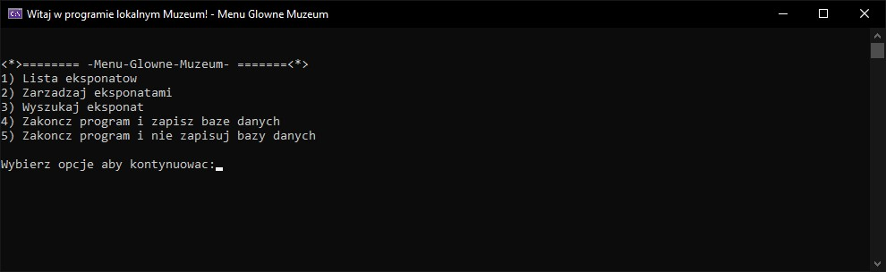
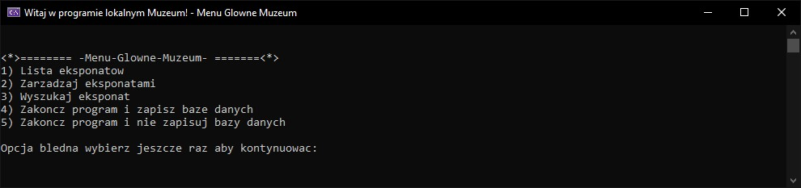
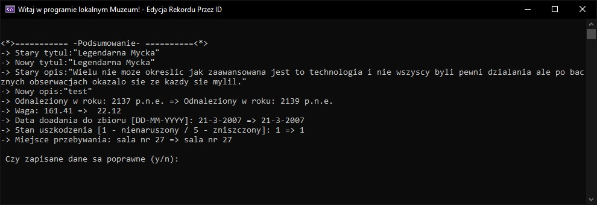
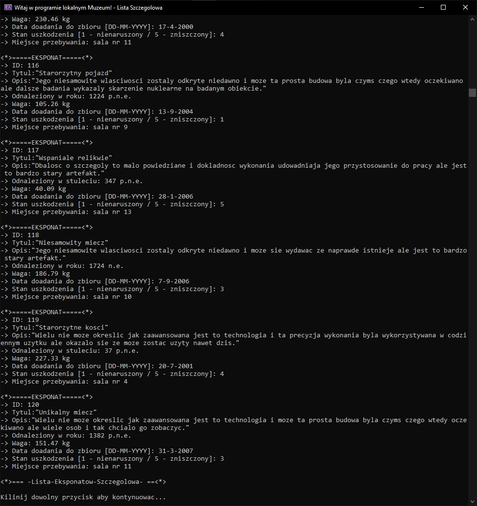

# 🏛️ Museum Exhibit Database System

A lightweight C application for managing museum exhibits via a linked list data structure. Developed with performance and low-level control in mind, it allows curators or archivists to add, edit, search, and manage exhibit records locally using a simple terminal interface.



## 📂 Features

- Dynamic, singly-linked list database of exhibits
- Persistent storage through file I/O (`lib_museum.mlib`)
- Full CRUD operations on exhibits
- Advanced search features:
  - By exhibit name
  - By date added
  - By room number
  - By historical century
- Precise date validation (including century mode)
- Flexible UI interaction via console
- Supports UTF-8 (when compiled with proper locale settings)
- Extensible codebase with modular function design

---

## 🧠 Data Model

Each exhibit is represented as a `struct lib`:

```c
struct lib {
 ulint id;
 uchar title[255];
 uchar descr[255];
 slint yearofexistence;
 bool century;
 float weight;
 usint day, month, year;
 uchar state;
 usint room;
 lib* nextval;
};
````

| Field                  | Description                                              |
| ---------------------- | -------------------------------------------------------- |
| `id`                   | Unique session-generated exhibit ID                      |
| `title`                | Exhibit title                                            |
| `descr`                | Exhibit description                                      |
| `yearofexistence`      | Year (or century if enabled) the exhibit originates from |
| `century`              | Flag: interpret `yearofexistence` as a century           |
| `weight`               | Exhibit weight in kilograms                              |
| `day`, `month`, `year` | Date added to the database                               |
| `state`                | Physical condition: `A` (new) → `E` (destroyed)          |
| `room`                 | Room number where the exhibit is located (0 = storage)   |

---

## 🎮 User Interactions

All input/output operations occur through the terminal. Menu navigation includes:

- View all exhibits
- Search exhibits by name/room/century/date
- Add a new exhibit
- Edit or remove an existing exhibit
- Export and import to/from a file

Sample input for adding an exhibit:

```txt
Enter Title: "Ancient Vase"
Enter Description: "Ceramic vase from 3rd century BC"
Year of Existence: 3
Is it a century? (y/n): y
Weight: 1.2
Date Added (dd mm yyyy): 01 06 2023
State (A-E): B
Room Number: 5
```

---

## 🧪 Test Data & Debugging

- The system includes error-checking for all user inputs.
- Edge case handling includes:
  - Leap years
  - Negative years (BCE support)
  - Character overflow in strings

---

## 🚀 Future Improvements

* Port to cross-platform C with POSIX compatibility
* GUI front-end using ncurses or WinAPI
* JSON or XML export/import
* Sort and filter options in output
* User authentication for multi-user museum systems

---

## 📸 Screenshot's

### User input validation



### Editor summary



### Detail list

